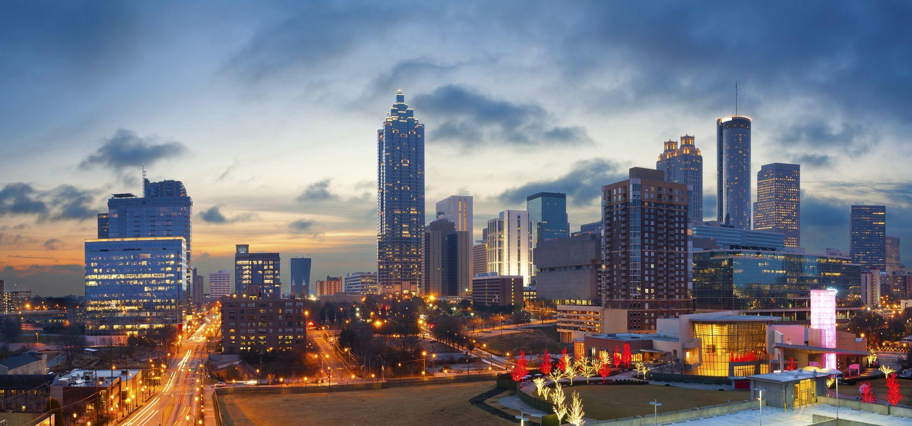

# Opening an Italian Restaurant in Atlanta

Atlanta is the capital and most populous city in the U.S. state of Georgia. With an estimated 2018 population of 498,044, it is also the 37th most-populous city in the United States. The city serves as the cultural and economic center of the Atlanta metropolitan area, home to 5.9 million people and the ninth largest metropolitan area in the nation.
## File Description

This project was developed in Python 3 and all the codes are located on the Jupyter Notebook NewAtlanta.ipynb.

## Business Problem

As a high populated city, Atlanta is an excellent place to start a new business, specially a restaurant. As part of this project we are interested in find the best locations in Atlanta for open an Italian restaurant in order to increase the investors profits. We want to focus on areas that are not full of restaurants, but also accessible and with a population who like this kind of places.

## Data

For our data we are taking into account the following:

* Number of restaurants in the location
* Number of Italian restaurants

For the data collection we  look in a radius of 15 km from the center of Atlanta. We look for the all the Italian places not only the restaurants. We use the word Italian as search query.

* We use the Foursquare API to obtain the data related to the Italian places in Atlanta.
* We use Nominatim API to obtain the coordinates of the venues.

## Methodology

We use GitHub  repository as a database. We collect all the data and saved into a Pandas Data Frame which we have to filtered to keep only the features with the relevant information to our study. As we set a radius of 15km, we obtain also some venues out of the limits of Atlanta and we eliminate them, obtaining a new data frame.
We have some categories like 'Boutique' that are totally out of the scope of our problem, in fact we are only interest in categories like 'Italian Restaurant' and 'Pizza Place'. Also, we have one NaN values and we are going to include the correct value manually. We used python folium library to visualize the location of the places on a map ofAtlanta.  We used latitude and longitude values to get the visual.
We used unsupervised learning K-means algorithm to cluster the places and find zones to place our restaurant. K-Means algorithm is one of the most common cluster method of unsupervised learning. We used 3 clusters, and obtain the merged table with cluster labels for each place.

## Results

We obtain a map of Atlanta with the places of our study divided by clusters:
The cluster violet is too far from the center of Atlanta and the locations are also sparse. Cluster red seems to be crowded with Italian Restaurants, therefore  we think that cluster green is the best possible place to our restaurant, due to is close to the center of the city and have only 3 Pizza Places and 3 Italian Restaurants.

To be sure that we want to open our restaurant next to these locations, we are going to find the maximum distance of a place in this cluster to the center of the city and make a search in this radius of all the common Italian venues. The maximum distance is 3866m and we are going to look in this radius for up to 100 Italian venues. After we clean and filtered all the data, we obtain a new Data frame. Postal Code 30308 is the one with more Italian Restaurants and Pizza Places, Postal Code 30316 is out of our limits and Postal Code 30312 has only one Italian venue. Therefore we consider that the best locations for opening our restaurant are Postal Codes 30303 and 30307.

## Discussion

We used the K-means algorithm as part of this clustering study. Despite Atlanta is a big city due to our Foursquare account limitations we can't obtain all the data we wanted.

We also performed data analysis through this information by adding the coordinates of places and we ended the study by visualizing the data and clustering information on the Atlanta map.

## Conclusion

Contrary as we expected the locations near to the center of the city where not crowded of Italian restaurant, making our decision easier.
